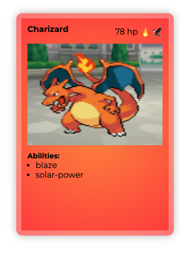

# Cartas Pokémon

Transformacion de la tarea de cartas pokemon en un generador dinamico de estas.

Puedes acceder a la web ya desplegada con node.js desde este [link](https://papiricoh.github.io/pokecartas/#/)

## Caracteristicas de la aplicacion web:
- En el directorio principal de la web se generara aleatoriamente un Pokemon de los 1008 actuales
- Se mostraran sus habilidades
- Se mostraran sus tipos en forma de emoticonos
- Se mostrara su nombre
- Si añadimos un numero del 1 al 1008 en la url tal que [asi](https://papiricoh.github.io/pokecartas/#/643): `https://papiricoh.github.io/pokecartas/#/643` accederemos al pokemon con el numero de la pokedex correspondiente en este caso el `643`
- Si añadimos `/multiple/:num` siendo num un 1 o mayor generaremos la cantidad que queramos de cartas a la vez [Ejemplo](https://papiricoh.github.io/pokecartas/#/multiple/4)
- Existe la posibilidad de 5 en cada 100 veces que la carta salga *Shiny*

## Instalacion:
- Clona el repositorio en tu entorno de desarrollo
- Realiza un `npm install` en la consola estando en el directorio principal de la aplicacion
- Introduce un `npm run dev` para desplegar su previsualizacion ( Recordamos que es indispensable la conexion internet pues se esta usando una API externa )

## Tecnologias usadas:
- CSS3
- HTML
- JavaScript
- Vue3.js
- Vite.js
- Vue-Router.js

### ORIGINAL README.MD:
Crear 4 cartas pokemon con html y css, siguiendo las siguientes directrices:

- Clonar el [siguiente repositorio](https://github.com/rodri-afa/pokecartas)
- Crear una carta para los siguientes pokemon: bulbasaur, charmander, squirtle y pikachu
- Las imágenes de los pokemon se adjuntan en la carpeta "img". También se adjunta una imagen de cómo se tendría que ver una carta
- Las 4 cartas se han de mostrar en una misma fila (utilizar la propiedad float)
- Cada carta estará compuesta por los siguientes divs:
  - **Cabecera:** donde se recoge el nombre del pokemon, los puntos de vida y los tipos
  - **Imagen:** con una imagen de fondo(pokemon-background.png) y la imagen del pokemon a mostrar
  - **Habilidades:** con un listado de las diferentes habilidades (consultar la [pokeapi](https://pokeapi.co/) para ver las habilidades de cada pokemon)
- Cada carta tiene una serie de estilos comunes que se los dará una **clase general** para todas las cartas :
  - los bordes redondeados,
  - un borde amarillo de 4 píxeles
  - sombra al rededor
- El fondo de cada carta tiene que ser de un color coherente con el tipo de pokemon (tipo fuego: fondo rojo, tipo agua: azul,etc) Crear una **clase para cada tipo de pokemon**. Dicha clase se ocupará simplemente de dar los atributos del color de fondo
- Crear el CSS en un fichero separado y referenciarlo de forma relativa

### Ejemplo

